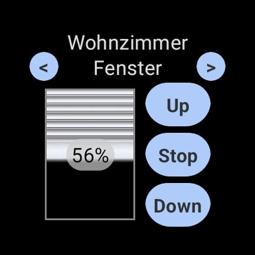
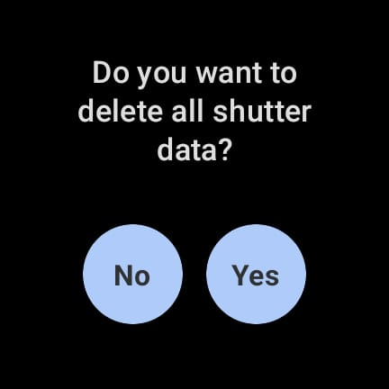

# Selve Control
> This was developed as part of the [Hack Club Arcade](https://hackclub.com/arcade/).

This is an App for WearOS which lets you control Commeo Shutters by Selve.
It utilizes the API for the Selve Home Server 2. Documentation can be found [here](https://www.selve.de/media/03/32/2d/1627308855/Selve_Home_Server_2.postman_collection.json.zip).
It comes with controls such as sending your shutter up and down, stopping it in motion or putting it to a custom percentage.

### Screenshots:

 

## Quick Showcase:

Since most people seeing this probably won't have Shutters by Selve to test this out, here is a quick showcase of how the app works:

https://github.com/user-attachments/assets/fcbfa86c-306f-42c9-86f5-7beacb2ae1a1

---

## Build it yourself

In order to run and build this app yourself, download the latest version of [Android Studio](https://developer.android.com/studio).
Either setup an emulator from the app with Android API Version <= 30 or connect your own watch with WearOS to your Computer using [adb](https://gsmchina.com/how-to-use-wireless-adb-debugging-on-wearos-3510/).
Afterwards, just hit run.

---

## Setup

Once you've setup Selve Control on your device, you are prompted to enter a Server IP and password. These have to match what is configured in your Selve Home Server 2.

---

### Quick Access

For quick access, there exists a tile that you can add to your watch, which quickly launches Selve Control.

---

## Resetting Data

If you've e.g. changed your Shutter configuration, you have the ability to reset all data of the shutters by tapping on the name of the currently selected shutter. As a result, the shutter data will be refreshed.

---

If you've e.g. changed your server password, you can reset the entire app by long pressing on the name of the currently selected shutter.

---

## Known Issues

There is an issue when switching the currently selected shutter, so some shutters are duplicated and others overridden. I currently have no idea as how to fix this. For Progress, see [#2](https://github.com/SchneiderMaster/selve-control/issues/2).
In case you experience this issue, just reset the data and refresh it from the server.